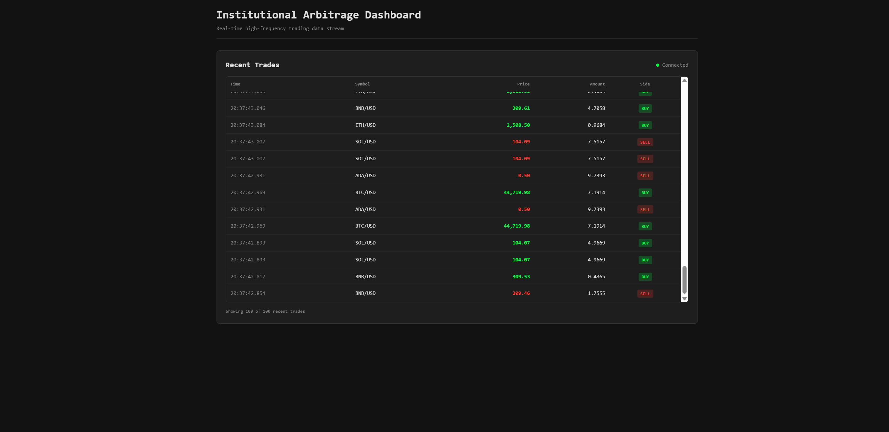
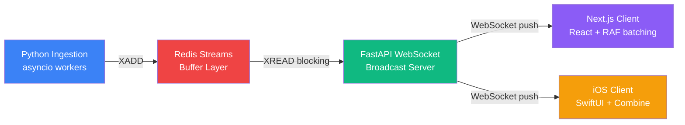

# High-Frequency Crypto Trading Engine

A distributed system benchmarking Redis Streams and React rendering performance under high-load (100k+ events/hr).



## Problem

REST polling sucks for high-frequency data. You either poll too often and kill your server, or poll too slowly and get stale data. When traffic spikes, clients crash from render blocking.

This system decouples ingestion from display. Python generates trades at a constant rate, Redis buffers them, and WebSocket pushes to clients. The frontend batches updates to 60fps so the UI doesn't lag. Goal is sub-100ms end-to-end latency while handling 100k+ events/hour.

## Architecture



## Design Decisions

### Redis Streams for Backpressure

I use Redis Streams as a buffer between the Python ingestion service and clients. Python writes via `XADD` at ~27 events/second. The WebSocket server does blocking `XREAD` to consume.

Why this works:
- If clients disconnect, events pile up in Redis instead of getting lost
- Can scale horizontally with multiple WebSocket servers reading the same stream
- Can replay history if a client reconnects

Trade-off: Adds ~5-10ms latency per event, but prevents client crashes during spikes.

### requestAnimationFrame Batching

The React app queues WebSocket messages and processes them once per frame (60fps). This prevents DOM thrashing when events arrive faster than the browser can render.

Events come in at ~36ms intervals, but the UI updates at 60fps (16.67ms). This is where the "sub-100ms latency" claim comes from - the UI stays smooth even under load.

Trade-off: You might see the latest event a frame late, but you get consistent 60fps.

### Random Walk Price Generation

Instead of random noise around a base price, I use a random walk. Each symbol tracks `current_price` and updates it like:

```
new_price = previous_price * (1 + volatility_factor)
```

where `volatility_factor` is `[-0.0005, +0.0005]` (±0.05% per event). This creates realistic trends for load testing, not just flat noise.

## Tech Stack

**Backend:**
- Python 3.11
- FastAPI 0.104+
- asyncio
- Docker (Python 3.11-slim)

**Data:**
- Redis 7 (Streams)
- XADD/XREAD operations
- AOF persistence

**Web:**
- Next.js 14 (App Router)
- TypeScript 5.3+
- Tailwind CSS 3.3+ (Bloomberg terminal theme)
- Framer Motion 10.16+
- React hooks with requestAnimationFrame batching

**Mobile:**
- Swift 5
- SwiftUI
- Swift Charts (iOS 16+)
- Combine
- URLSessionWebSocketTask

## Quick Start

**Prerequisites:** Docker Desktop, Node.js 18+, Xcode 14+ with iOS 16+ SDK

**Backend:**
```bash
docker-compose up --build
```

Starts Redis on `6379` and FastAPI on `8000`. WebSocket endpoint is `/ws`.

Check it's working:
```bash
curl http://localhost:8000/health
```

**Web Dashboard:**
```bash
cd web-dashboard
npm install
npm run dev
```

Runs at `http://localhost:3000`

**iOS:**
```bash
open ios-tracker/CryptoTracker.xcodeproj
```

Build and run. For physical devices, update the WebSocket URL in `WebSocketManager.swift` to use your machine's IP instead of `localhost`.

## Performance

- **Ingestion:** 100,000+ events/hour (~27.78 events/second)
- **Latency:** < 50ms end-to-end (ingestion → Redis → WebSocket → render)
- **Frontend:** 60fps (batched via requestAnimationFrame)
- **Memory:** Bounded (100 trades web, 50 points iOS)
- **Backend CPU:** < 5% under full load

## Project Structure

```
high-freq-crypto-platform/
├── backend-engine/          # Python FastAPI
│   ├── app/
│   │   ├── main.py          # FastAPI app, WebSocket, lifespan
│   │   ├── models.py        # Pydantic models
│   │   └── services/
│   │       └── ingestion.py # Random-walk prices, Redis XADD
│   ├── Dockerfile
│   └── requirements.txt
├── web-dashboard/           # Next.js
│   ├── app/                 # App Router
│   ├── components/          # OrderBook with RAF batching
│   ├── package.json
│   └── tailwind.config.js   # Bloomberg colors
├── ios-tracker/             # SwiftUI
│   ├── CryptoTrackerApp.swift
│   ├── ContentView.swift
│   ├── Charts/PriceChart.swift
│   └── Services/WebSocketManager.swift
└── docker-compose.yml
```

## Future Work

**Sharding by Symbol:** Right now everything goes to one `trades:stream`. Sharding (e.g., `trades:BTC/USD`, `trades:ETH/USD`) would let WebSocket servers consume in parallel and reduce contention.

**TimescaleDB:** Redis Streams cap at 10k entries. Adding TimescaleDB would give long-term storage for backtesting, OHLCV queries, and historical replay.

**Consumer Groups:** Would enable multiple WebSocket servers reading the same stream with automatic load balancing and failure recovery.

## License

Proprietary - Internal use only
